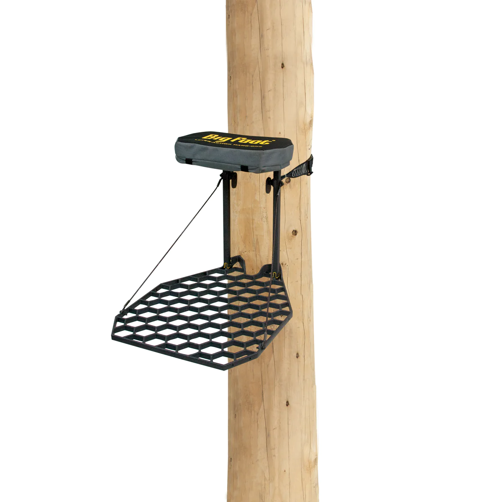

## Caledonia's 98271G - _Gear Goblins_
Team Members: Isaac Robotham and James Diegel
Coach: Andy Robotham

#### Contents
[About The Team](https://github.com/jmdiegel707/Vex-2023-34-Notebook/blob/main/README.md#about-the-team)

[August 30](https://github.com/jmdiegel707/Vex-2023-34-Notebook/blob/main/README.md#august-30-2023)

[September 5](https://github.com/jmdiegel707/Vex-2023-34-Notebook/blob/main/README.md#september-5-2023)

[September 12](https://github.com/jmdiegel707/Vex-2023-34-Notebook/blob/main/README.md#september-12-2023)

[September 14](https://github.com/jmdiegel707/Vex-2023-34-Notebook/blob/main/README.md#september-14-2023)

[September 19](https://github.com/jmdiegel707/Vex-2023-34-Notebook/blob/main/README.md#september-19-2023)

[September 26](https://github.com/jmdiegel707/Vex-2023-34-Notebook/blob/main/README.md#september-26-2023)

[October 3](https://github.com/jmdiegel707/Vex-2023-34-Notebook/blob/main/README.md#october-3-2023)

[October 12](https://github.com/jmdiegel707/Vex-2023-34-Notebook/blob/main/README.md#october-12-2023)

[October 17](https://github.com/jmdiegel707/Vex-2023-34-Notebook/blob/main/README.md#october-17-2023)

[October 26](https://github.com/jmdiegel707/Vex-2023-34-Notebook/blob/main/README.md#october-26-2023)

#### About the Team
- __Isaac:__ I am a sophmore in highschool. I play tennis on the Caledonia Varsity team. I also do marching band where I play the Bari Saxophone. I like to do cybersecurity related things as a hobby along with playing video games.
- __James:__ I am also a sophmore at Caledonia. I'm on JV Tennis, Sypmphony Orchestra, and Vex Robotics! Originally in sixth grade, I joined robotics, introducing me to coding and putting me on my path to study software design past my high school education.

#### August 30, 2023
First Practice

Besides the program requirements like contracts, inventory, choosing competition dates, team name, and shirts, we jumped straight into the brainstorming phase. We started by analyzing this years game and picking out the main features to tackle:
- Scoring
- Descoring
- Crossing the middle bar
- Elevating the bot

At face value the game seemed fairly simple and we couldn't see any exploits. We based our design based on these factors, and though we made the mistake of not drawing any designs out, we decided a push bot would be effective enough. A main point of design for our bot is the wheels. We choose mecanum wheels due to their great traction for pushing triballs under the bars while scoring/descoring, the shape which allows us to "grab" onto and climb over the middle bar, and the bonus of extra mobility.

Quickly we discovered through other teams some exploits that may be used. They explained how a catapult could be used to launch preloads at high speeds to the other side, even during autonomous period (we have yet to reference the rules if this is legal). While there may not be much to combat this, we can add this to the list of factors to think of while designing.

#### September 5, 2023
Second Practice

Because of the simple nature of our design, we sort of traded off work during this practice. For about the first half, Isaac built our chassis. We wanted our wheels exposed in order to climb over the middle bar easier. Because of this he took more time to reinforce the frame then we unspokenly traded off for James to assemble the wheels. After putting the wheels on, the bot seemed surprisingly sturdy and functional for the speed it was constructed. We threw together a simple drive code and while the tank drive (Left axis on controller controls left wheels; Right axis, right motors) functioned properly, the explicit side to side movements did not. When attempting to drive left, the robot spun counter-clockwise, and when going right, it did not move at all.

#### September 12, 2023
Third Practice

We focused first on correcting mistakes from the first practice: Drive code, and a new problem we discovered, the exposed wheels allowed the axles to warp.
After correcting the code, which took a few trips to the practice field, we had a fully fuctioning tank drive and explicit side to side working. With that out of the way, we focused on the wheel instability. This raised yet another problem: we need the front and back of the wheels exposed and further out than the rest of the bot to catch onto the middle bar properly. This was a simple enough fix as we added c-channels on either side of the bot to stabilize the wheels, then secured those bars with two more going perpendicular on top and on bottom of the robot to secure it to the chassis.

We then began brainstorming more efficient ways to get triballs over the middle bar, beacuse our bot can, but the balls don't always.

#### September 14, 2023
Fourth Practice

We spent the whole practice brainstorming (and a little bit of socializing) how to get triballs over the middle. While some were in the right orientation to slide right over, others would press under the bar, where they obviously won't fit. We decided we needed a plate on an incline that was just low enough to scoop under the ball. While that gets the balls unstuck and pushes them up as you drive towards the mid-bar, the ball sometimes fell back onto our bot and gets stuck there. We eventually realized we needed a second vertical plate about an inch behind the first inclined one to help fully push the ball over the middle.

#### September 19, 2023
Fifth Practice

We constructed the buldozer design we dicussed last practice. It took us longer than it should have.

#### September 26, 2023
Sixth Practice

Tonight was a brainstorming night. With our bot fairly stable, we needed to expand. We mainly brainstormed ideas for elevating the robot and a little about a catapult.

#### October 3, 2023
Seventh Practice

This notebook was originally written poorly, so while Isaac looked at videos of other programs and teams' bots for ideas, James rewrote the previous few practices.
Later, we  began looking into the programming. While our wheels give us the capability to strafe and move in 4 dementions, we were only taking advantage of forward/backward movement, and inherintly turning. We found a useful diagram of all the movement that mecanum wheels offer:

Using these, we set up the program so the horizontal and vertical axis on the controller correspond to different variables in the code. We went through 6 or 7 different relationships before we reached a working program. The bot can now strafe.

#### October 12, 2023
First League Night

Notes:
- Accidentally violated double-zoning rule.
- Learned you cannot push bots off after they elevate (not through experience, just looked it up).
- Had many talkative teamates, so we had good practice planning out matches.
- Rear supporting bar of the chassis became _very_ concaved by the end of the night; Brings up the thought of reinforcing/re-designing the chassis

#### October 17, 2023
Eighth Practice

Tonight's focus is on elevation. Currently our robot's only funtion is pushing balls, so the next step is elevating the robot. 

A quick tangent:
Given that
- To be elevated, a robot must not be touching an Elevation Bar Cap
- The only rule that seems to apply to robot/field interaction is Rule G7, which prohibits robots from grabbing or attatching to Field Elements (the Elevation Bar Cap is a Field Element)

... there are no rules prohibiting you from pushing the Cap off. If you could manage to get the cap off, you could go just higher than other bots. If you are called out by a ref, you can argue that you did not attach yourself to any Field Elements (not violating G7) and did not violate any "Elevated" criteria either.

Thoughts on elevation:
In our first league the other night, we saw many robot try to do essentially a pull-up on the horizontal part of the elevation bar, but they weren't strong enough to hold. Plus, when the match ends, the motors deactivate, so breaks don't work either. Isaac proposed a mechanism that uses tension like a tree stand does.

#### October 26, 2023
Second League Night

Notes:
